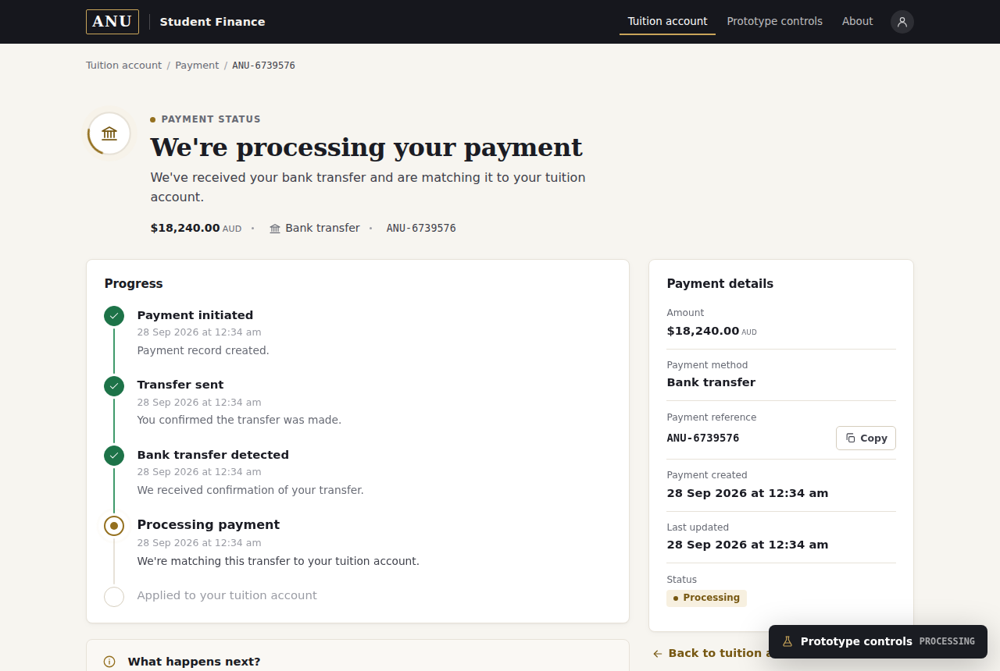
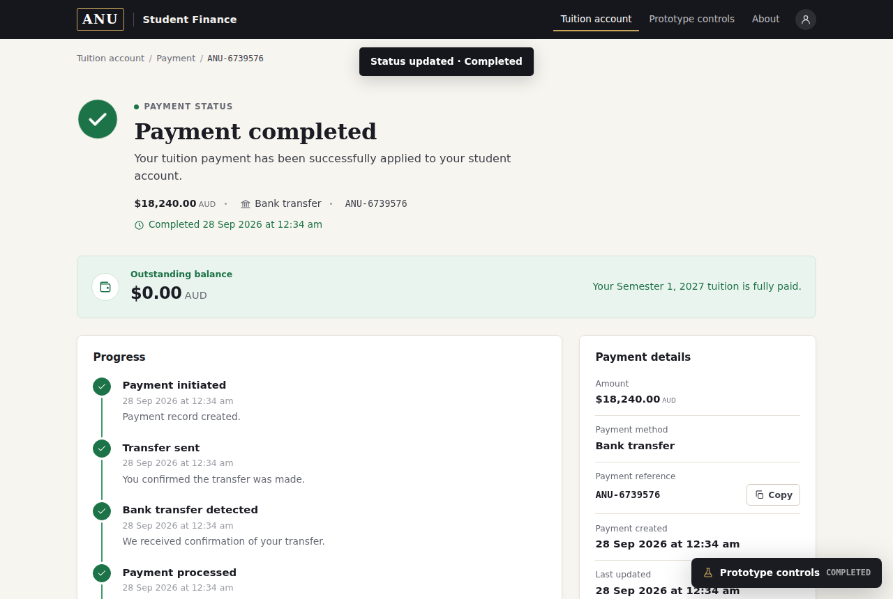
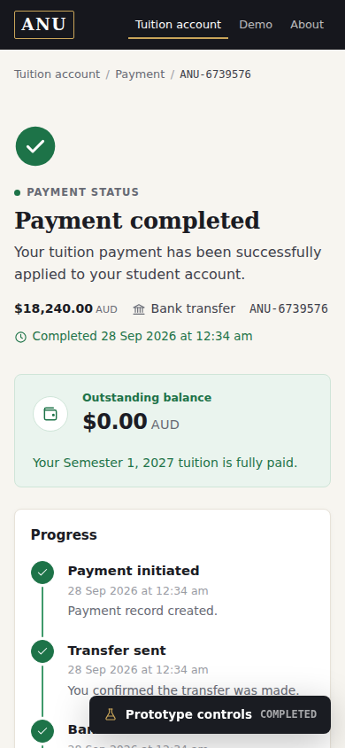

# ANU Payment Tracker

A prototype of the part of paying tuition that usually gets no design at all:
the days between the money leaving your bank and your balance changing. You
start a payment, get a real persisted payment reference, and then watch a
tracker that answers the three questions a student actually has — _where is my
money, what happens next, and do I need to do anything?_ — until the payment is
applied and the balance reads $0.00. It models one fictional student and
processes no real money; a prototype-controls panel stands in for the bank and
card events a real system would receive.

## Try it

1. **Pay tuition** → **Bank transfer** → **I've made the transfer**.
2. Open **Prototype controls** (bottom right of the tracker, or `/demo/`) and
   step through _Simulate bank receipt_ → _Start ANU processing_ →
   _Complete payment_. Each click writes to the database and returns you to
   the tracker, which animates the change.
3. Refresh at any point — the state is SQLite on the server, not the browser.
4. **Reset demo** puts everything back to an unpaid account.

Try _Simulate delay_, or **Card payment** → _Simulate declined card_, for the
exception states.

## What good looks like here

**Reducing uncertainty is the product.** Every state is written to answer
"where is it, what next, do I need to act", with a timeline showing what has
happened and what hasn't, and a _What happens next?_ panel that changes with
the state. Delays and failures say plainly what they mean for your balance.

**Trustworthy rather than impressive.** I looked at how Wise, Apple Wallet's
transaction details, modern banking apps and good government service pages
handle transaction status, for their hierarchy and restraint, not their look.
The result is a warm neutral page, ANU-inspired gold used sparingly, and colour
that always means something: green only once money is confirmed, amber for
waiting too long, red only for failure. Motion is feedback: it plays when the
status has actually changed since you last looked, never on a plain refresh,
and not at all under reduced motion.

**The server decides what can happen.** Payment state moves only through one
transition table, so an out-of-order step is refused (HTTP 409) rather than
trusted from the browser. Money is stored as integer cents. An account has at
most one payment in flight. Completing a payment and zeroing the balance happen
in one transaction, so the two can never disagree.

**What's enforced, and what's judgement.** `spec/payment-tracker.test.ts`
drives a real bank transfer through the whole lifecycle over HTTP and checks it
survives a reload, that an illegal transition is rejected, and that reset
restores the account. `spec/invariants.test.ts` holds every page to an
accessibility floor, including zero axe-core violations. Whether it looks and
reads like a service you'd trust with $18,240 can't be tested; that part is a
judgement call.

## What I chose not to build

No real payment processing, bank integration or card entry. No sign-in or
multiple students. No refunds, partial payments or payment plans. No email or
push notifications. Each is real work in a real system, but none of them
changes whether the tracker answers the student's questions. They'd have taken
time away from the part this prototype is arguing for.

## How it's built

Astro in server mode, Drizzle ORM and SQLite, deployed to a single Fly.io
machine with the database on a volume. Migrations run at boot, and an empty
database seeds the demo account itself, so a fresh volume (or the test
harness) comes up working.

